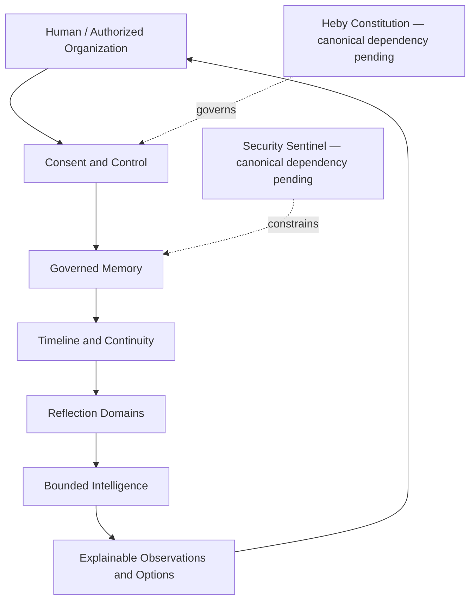
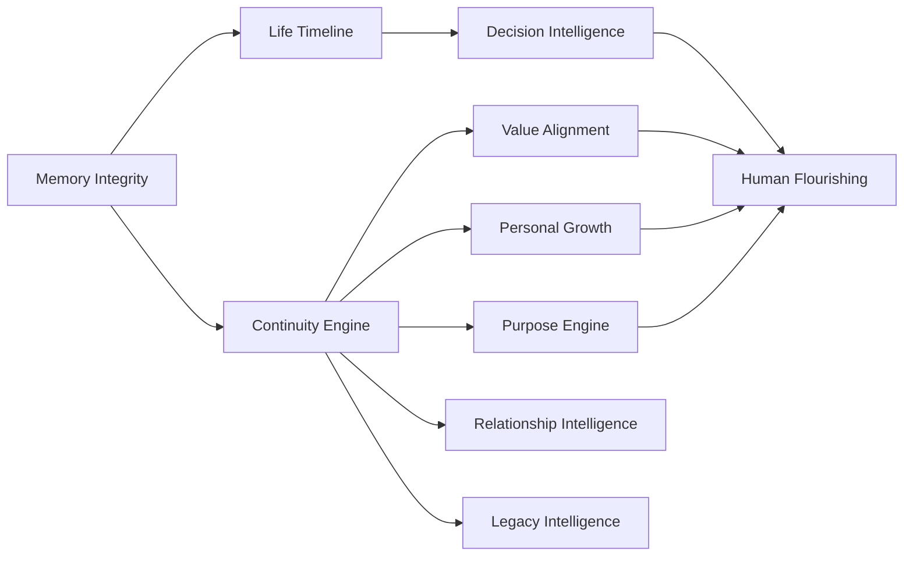
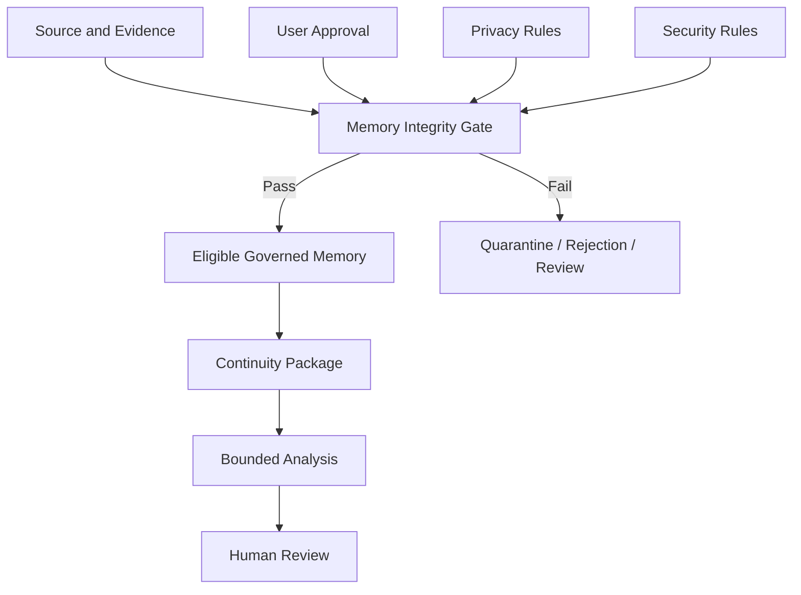
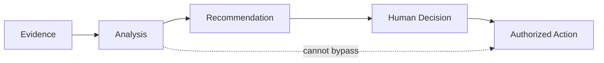

# 12 — Architecture Diagrams

## Logical Context Architecture

The return to the human represents review and judgment, not autonomous feedback optimization.

## Domain Architecture

Arrows mean governed evidence supply or analytical dependency, not execution control.

## Trust Boundary

## Decision Authority

## Diagram Invariants

- Memory remains distinct from Runtime state.
- Analysis cannot directly reach action.
- Constitution and security controls govern admission and use.
- User approval is required for personal permanent memory.
- Diagrams are logical architecture, not deployment topology or workflow implementation.

