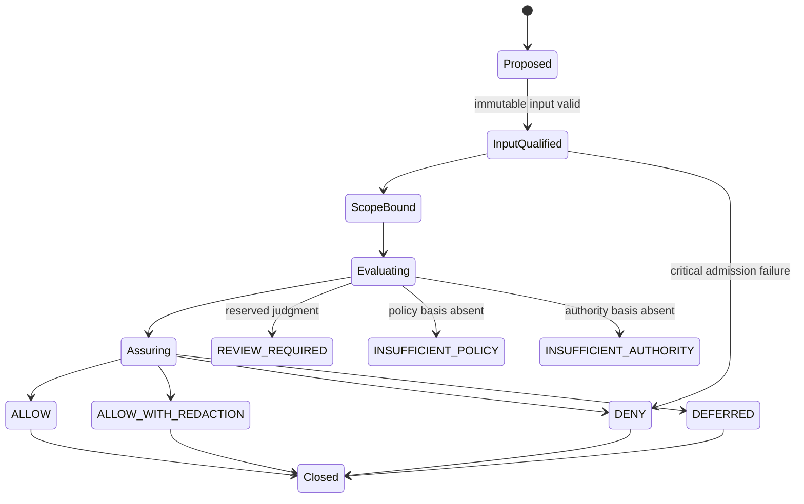

# 12 — Governance State Machine

## Purpose

This document defines canonical semantic states for Governance Case, Evaluation Unit, Constraint, Review Requirement, Trace, and Outcome Package.

## State Sets

- **Governance Case:** Proposed → Input Qualified → Scope Bound → Evaluating → Assuring → Packaged → Closed.
- **Evaluation Unit:** Declared → Applicability Validated → Evaluated → Validated → Retained; alternatives are Rejected, Conflicted, Insufficient, or Superseded.
- **Governance Constraint:** Referenced → Qualified → Applicable, Not Applicable, Conflicted, Insufficient, Expired, or Revoked.
- **Review Requirement:** Identified → Classified → Pending External Review → Resolved Externally, Superseded, or Retained.
- **Governance Trace:** Initiated → Append-Only Active → Validation Complete → Finalized → Retained or Superseded.
- **Outcome Package:** Assembling → Assuring → one canonical Outcome State → Released or Withheld → Retained or Superseded.

## Rules

- **GSTATE-001:** Semantic state must remain distinct from Runtime status.
- **GSTATE-002:** Every transition records basis, rule version, actor reference, time reference, and Trace identity.
- **GSTATE-003:** Terminal Outcomes are immutable; re-evaluation creates a new version.
- **GSTATE-004:** Review states cannot transition to ALLOW through silent assumption.
- **GSTATE-005:** State changes must not modify reasoning or governing references.
- **GSTATE-006:** Forbidden transitions require negative validation.

## Boundaries

No state store, event bus, timer, authorization gate, or state-machine implementation is selected.
