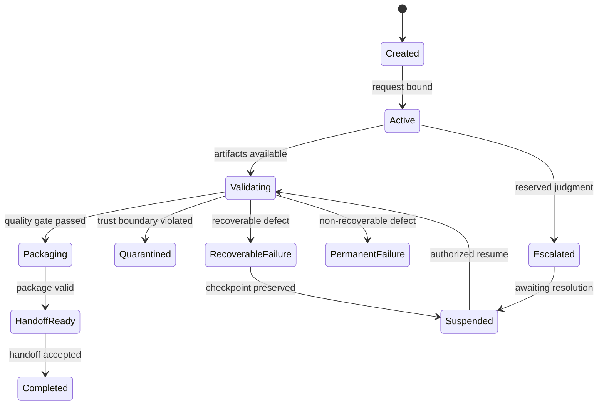

# 12 — Processing State Machine

## Purpose

This document defines canonical semantic states and permitted transitions for Phase 13 records. States express architectural condition; they do not prescribe a Runtime state-machine implementation.

## Processing Request States

`Draft → Submitted → Admitted → Validated → Bound`

Alternative outcomes are `Rejected`, `Suspended`, `Quarantined`, `Withdrawn`, or `Escalated`. A changed bound request becomes `Superseded`; a replacement request receives a new identity or version.

## Processing Case States

`Created → Active → Validating → Packaging → Handoff Ready → Completed`

An Active or Validating case may become `Partially Complete`, `Suspended`, `Recoverable Failure`, `Permanent Failure`, `Quarantined`, or `Escalated`. Resume returns only through validation of the preserved checkpoint.

## Processing Artifact States

`Registered → Produced → Validating → Valid → Current`

Alternative states are `Invalid`, `Conditional`, `Quarantined`, `Withdrawn`, `Revoked`, and `Superseded`. Immutable versions never return to an earlier content state.

## Stage Handoff States

`Prepared → Offered → Entry Validating → Accepted → Acknowledged`

Alternative states are `Rejected`, `Suspended`, `Quarantined`, `Expired`, or `Escalated`. Acceptance transfers processing responsibility only.

## Processing Output Package States

`Assembling → Validating → Ready → Offered → Accepted → Completed`

Alternative terminal or limiting states are `Conditional`, `Rejected`, `Quarantined`, `Superseded`, `Revoked`, `Failed`, and `Escalated`.

## Transition Rules

- **STATE-001:** Every state transition must record prior state, next state, basis, time, actor, and correlation identity.
- **STATE-002:** Terminal states may be followed only by explicit supersession, reprocessing, revocation, or a new record.
- **STATE-003:** Quarantined records must not enter ordinary processing until explicitly released and revalidated.
- **STATE-004:** Suspended records preserve their last valid checkpoint and unresolved requirements.
- **STATE-005:** Recoverable failure must not be represented as completion.
- **STATE-006:** State transition validity must be tested independently for Request, Case, Artifact, Handoff, and Output Package.
- **STATE-007:** Escalation records a need for authority; it does not supply the authority.

## Boundaries

States describe semantic validity and eligibility. They do not define storage status codes, timers, message delivery, concurrency control, or Runtime orchestration.
