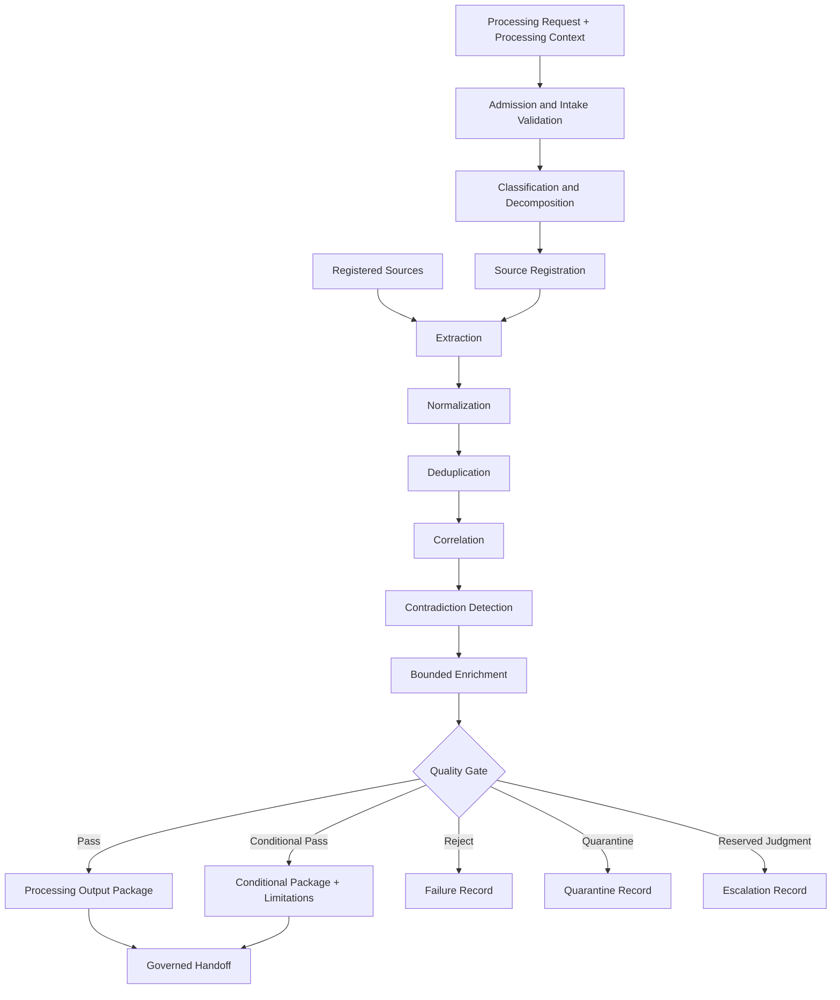
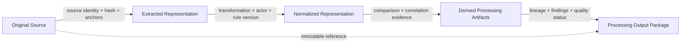

# 13 — Canonical Pipeline Data Flow

## Purpose

This document defines how content, metadata, provenance, validation findings, failures, and escalation records flow through Phase 13.

## Input and Transformation Flow

## Metadata and Provenance Propagation

Every transformation carries forward tenant, source identity, classification, authority, timestamps, content hash, transformation history, validation status, limitations, supersession status, and parent-child lineage.

## Checkpoints

Validation occurs at admission, registration, extraction, normalization, correlation, contradiction detection, enrichment, packaging, and handoff. A checkpoint may pass, conditionally pass, reject, quarantine, suspend, or escalate the affected scope.

## Failure and Escalation Paths

Failures produce traceable Failure Records attached to affected artifacts. Recoverable failures preserve a checkpoint; permanent failures terminate the affected branch. Trust, tenant, authority, or reserved-judgment violations cause quarantine or escalation, never silent continuation.

## Rules

- **FLOW-001:** Content and metadata flows must remain correlated but independently inspectable.
- **FLOW-002:** Provenance must propagate through every transformation and package boundary.
- **FLOW-003:** Validation findings must travel with affected artifacts.
- **FLOW-004:** Failure paths must not discard valid upstream evidence.
- **FLOW-005:** Packaging must preserve direct navigation from every material representation to its original source.
- **FLOW-006:** A data-flow diagram must not be interpreted as a Runtime workflow or deployment topology.

## Boundaries

No transport, serialization, service, database, event bus, storage engine, or infrastructure is selected.
