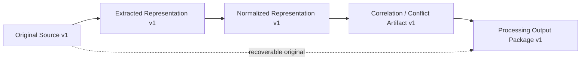

# 16 — Provenance and Lineage Architecture

## Purpose

Provenance explains where information came from. Lineage explains how each representation was produced. Together they make processing evidence reconstructable without converting derived content into canonical truth.

## Representation Chain

1. **Original Source** — immutable source identity, version, location reference, hash, classification, and authority.
2. **Extracted Representation** — source-bounded content with citation anchors and extraction evidence.
3. **Normalized Representation** — meaning-preserving form with variance and transformation record.
4. **Derived Representation** — correlation, contradiction, enrichment, quality, or packaging artifact.
5. **Processing Output Package** — governed collection retaining navigation through every parent to the Original Source.

## Lineage Record

Each parent-child relationship records parent and child identities and versions, transformation type, processing actor, applicable rule version, timestamps, input and output hashes, citation anchors, validation outcome, limitations, and supersession state.

## Reconstruction

Lineage reconstruction must reproduce the declared transformation chain and verify identities, versions, hashes, anchors, rules, actors, and validation evidence. Reconstruction failure creates a blocking Lineage Integrity finding.

## Rules

- **LINEAGE-001:** Every derived artifact must have at least one traceable parent and an Original Source path.
- **LINEAGE-002:** Original Source material must remain recoverable according to authority, retention, and legal constraints.
- **LINEAGE-003:** Generated, extracted, normalized, or enriched content must never replace the Original Source.
- **LINEAGE-004:** Transformations must record actor, rule version, time, hashes, and rationale.
- **LINEAGE-005:** Citation anchors must remain stable or carry an explicit remapping record.
- **LINEAGE-006:** Parent-child lineage must survive packaging, supersession, revocation, and reprocessing.
- **LINEAGE-007:** Broken lineage must block claims that depend on the affected artifact.

## Boundaries

Lineage establishes traceability, not truth, correctness, authority, ownership transfer, or reasoning validity.
