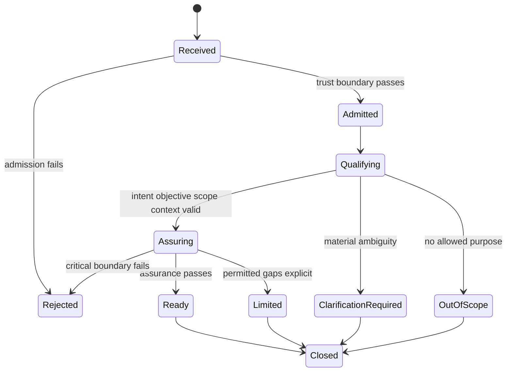

# 12 — Query State Machine

## Purpose

This document defines canonical semantic states for Query Case, Query, Intent, Objective, Scope, Context Assembly, Query Trace, and Reasoning Request Package.

## State Sets

- **Query Case:** Received → Admitted → Qualifying → Assuring → Ready or terminal non-package outcome → Closed.
- **Query:** Registered → Preserved → Classified → Qualified → Retained.
- **Intent:** Candidate → Resolved, Multi-Intent, Ambiguous, Unsupported, or Out of Scope.
- **Objective:** Proposed → Refined → Validating → Ready, Limited, Rejected, or Clarification Required.
- **Scope:** Proposed → Resolving → Resolved, Partial, Ambiguous, Conflicted, Insufficient, or Out of Scope.
- **Context Assembly:** Declared → Classified → Qualified → Complete, Limited, Missing, or Rejected.
- **Query Trace:** Initiated → Append-Only Active → Validated → Finalized → Retained or Superseded.
- **Reasoning Request Package:** Assembling → Assuring → Ready, Ready with Limitations, Clarification Required, Insufficient Context, Rejected, or Out of Scope → Retained or Superseded.

## Rules

- **QSTATE-001:** Semantic state must remain distinct from Runtime status.
- **QSTATE-002:** Every transition records prior state, next state, basis, time reference, rule version, and Trace identity.
- **QSTATE-003:** Rejected, quarantined, ambiguous, unsupported, and out-of-scope states cannot transition silently to Ready.
- **QSTATE-004:** Terminal records are immutable; requalification creates a new version or Case.
- **QSTATE-005:** State changes must not modify the Query, Context source, or Processing Output Package.
- **QSTATE-006:** Forbidden transitions require negative validation.

## Boundaries

No state store, event bus, timer, message, lock, concurrency, or state-machine implementation is selected.
