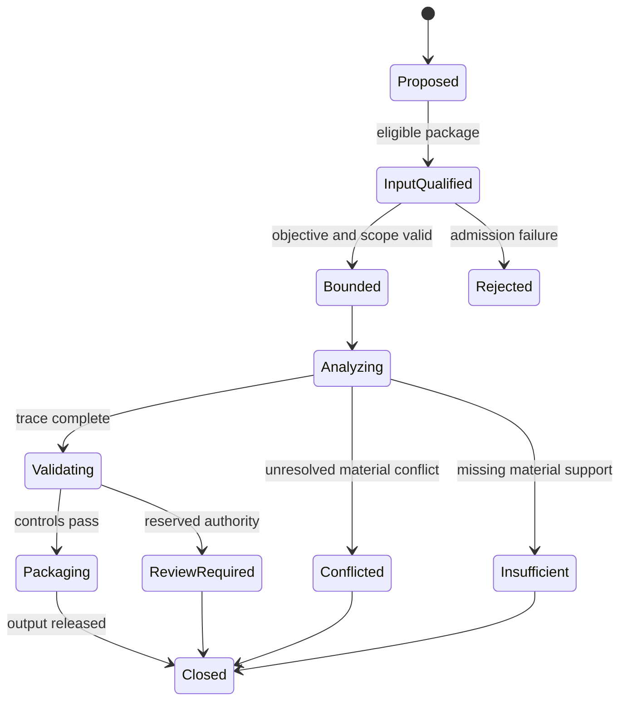

# 12 — Reasoning State Machine

## Purpose

This document defines canonical semantic states for Reasoning Case, Unit, Hypothesis, Result, Trace, and Output Package.

## State Sets

- **Reasoning Case:** Proposed → Input Qualified → Bounded → Analyzing → Validating → Packaging → Closed.
- **Reasoning Unit:** Declared → Premises Qualified → Evaluated → Validated → Retained; alternatives are Rejected, Conflicted, or Superseded.
- **Hypothesis:** Proposed → Bounded → Testable/Untestable → Supported/Partial/Unsupported/Conflicted/Indeterminate → Closed.
- **Reasoning Result:** Proposed → Validating → Supported/Partially Supported/Insufficient/Conflicted/Rejected/Review Required → Released.
- **Reasoning Trace:** Initiated → Append-Only Active → Validation Complete → Finalized → Retained or Superseded.
- **Reasoning Output Package:** Assembling → Validating → Ready/Limited/Rejected/Review Required → Released → Superseded or Retained.

## Transition Controls

Every transition records identity, prior and next state, basis, evidence reference, rule version, time reference, responsible reasoning role, limitations, and Trace correlation. Terminal state content is immutable; re-analysis creates a new version or Case.

## Rules

- **RSTATE-001:** Semantic state must remain distinct from Runtime status.
- **RSTATE-002:** Invalid or quarantined inputs cannot transition into Analyzing.
- **RSTATE-003:** Terminal outcomes cannot be relabeled without a new immutable version.
- **RSTATE-004:** Conflicted, Insufficient, Rejected, and Review Required remain valid terminal outcomes.
- **RSTATE-005:** State changes must not mutate Phase 13 artifacts.
- **RSTATE-006:** Forbidden-transition tests are mandatory for every state-bearing component.

## Boundaries

No persistence state, message delivery, timer, lock, concurrency model, or implementation state machine is selected.
