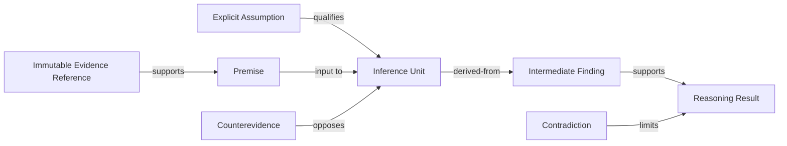

# 13 — Evidence Graph Architecture

## Purpose

The Evidence Graph is a Case-bounded logical view that connects immutable evidence references, premises, assumptions, hypotheses, Inference Units, conflicts, and Results. It is not the Phase 11 Knowledge Graph and not a database graph.

## Node Classes

- Evidence Reference
- Premise
- Assumption
- Hypothesis
- Inference Unit
- Counterevidence
- Contradiction
- Intermediate Finding
- Reasoning Result
- Limitation

## Relationship Classes

`supports`, `opposes`, `qualifies`, `assumes`, `derived-from`, `contradicts`, `depends-on`, `limits`, `supersedes`, and `cites`.

Each relationship has identity, direction, source and target, evidence basis, inference or rule reference, Scope, authority limitation, uncertainty, and Trace position.

## Graph Integrity

Every Result must have a traversable path to at least one eligible evidence reference. Assumption-only paths cannot yield an unqualified supported Result. Cycles must represent explicit analytical feedback or mutual dependency and cannot serve as self-support.

## Rules

- **EGRAPH-001:** The Evidence Graph must remain Case-, Scope-, package-, and Tenant-bound.
- **EGRAPH-002:** Evidence nodes are immutable references, not copied source authority.
- **EGRAPH-003:** Every Result path must expose assumptions, counterevidence, conflicts, and limitations.
- **EGRAPH-004:** Circular support must not establish evidence or confidence.
- **EGRAPH-005:** Uncertain relationships must remain typed as uncertain.
- **EGRAPH-006:** Graph structure must be reconstructable from the Reasoning Trace.
- **EGRAPH-007:** The Evidence Graph must not mutate the Knowledge Graph or Processing Output Package.

## Boundaries

No graph schema, query language, traversal engine, database, index, embedding, or visualization implementation is defined.
